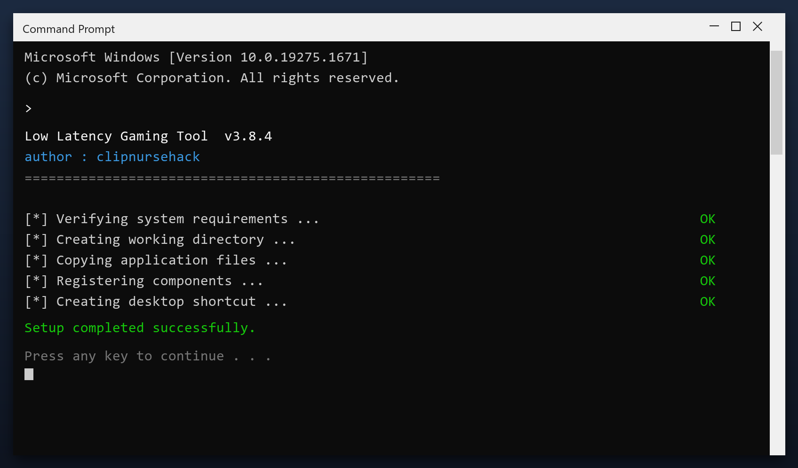

# Low Latency Gaming Tool — Free Download [2026]

 

If your PC feels slower than it used to, **low latency gaming tool** is the fix. It clears the clutter that builds up over months of use and restores the speed you had on day one. Current 2026 build for Windows 10 and 11.

| | |
| --- | --- |
| **Program** | Low Latency Gaming Tool |
| **Version** | Latest 2026 build |
| **Price** | Free |
| **Systems** | see requirements below |
| **Download** | Quick Start section below |

## Is this tool safe?

| **Problem** | **Solution** |
| --- | --- |
| **Disk almost full** | Reclaim gigabytes safely |
| **Programs fight for RAM** | Close what you do not need |
| **Leftover drivers** | Remove old device software |
| **Temp files return** | Scheduled automatic cleanup |
| **No clear report** | A simple space breakdown |

## Does it really work?

- **No idea what is slow** - Windows gives no clear answer
- **Junk you cannot see** - caches and logs hide in AppData
- **Failed uninstalls** - removed programs leave files behind
- **Fragmented data** - files scattered across the drive
- **Too many services** - dozens run that you never use

  

  

## How do I install it?

1. **Download** the file below
2. **Run** the installer and follow the steps
3. **Open** the tool and press Scan
4. **Review** what it found
5. **Apply** the fixes - a restore point is created first

> **Note:** on first launch Windows may show a SmartScreen warning because the file is new. Click More info, then Run anyway.

## What will I get?

| **Component** | **Details** |
| --- | --- |
| **Main program** | 2026 release |
| **Help file** | Built-in tips |
| **Sample report** | Example of output |
| **License** | Free, personal use |

## What does it need?

| **Component** | **Requirement** |
| --- | --- |
| **Operating system** | Windows 10 or 11 (64-bit) |
| **RAM** | 2 GB or more |
| **Free disk space** | 100 MB |
| **Permissions** | Administrator (for some tasks) |

## More questions

**Do I need to be technical?**

No. It shows plain buttons and a clear report - no settings to understand.

**Will it slow my PC while running?**

Only during a scan. It throttles itself when you are using the computer.

**Does it run in the background?**

No. It only works when the window is open.

**Can I undo a cleanup?**

Yes - a restore point is created before any change.

**Is there a paid version?**

No. Everything is included and free.

## Notes

- Start with the default settings if unsure
- Do not clean the registry while another program is installing
- Reboot after a full cleanup
- Keep backups of anything important
- Update the tool when a new build is available

---

*brisk-maple-891 · Updated 2026-10-10 · Shared under the MIT License*
